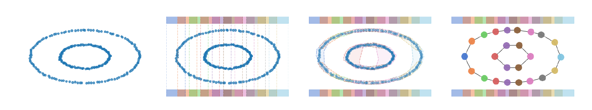

# Mapper Comparison

Accompanying code for paper *Mapper Comparison with 
Wasserstein Metrics*. Paper available in paper_pdf directory.

This repo is intended for the evaluation of different candidate metrics for 
comparing Mapper graphs. Mapper is an unsupervised learning algorithm based 
in Topological Data Analysis that generates a simplified nerve complex 
representation from a data set that captures topological features of a 
metric space.

One challenge using Mapper graphs is that without an indicator of goodness
of fit, it can be challenging to determine when a Mapper model (or nerve 
complex representations in general) no longer fits that data. However, if 
we had a metric over Mapper graphs that captured all of the properties we're
interested in, then we could evaluate the degree to which Mapper graphs would
be expected to change over different samples of the same population, which 
could be used to identify when new samples have significantly deviated from
the previous model. 

This repository contains code from the paper *Mapper Comparison with 
Wasserstein Metrics*, which attempts to address this issue by comparing Mapper
graphs as metric-measure spaces and introduces a Wasserstein distance variant,
 the Network Augmented Wasserstein (NAW) distance, which intuitively captures
 differences between the topological, metric, and density information represented
 by Mapper graphs. 
 
## Usage

This repo comes equipped with the actual distance measures and with a lightweight 
mapper implementation that the distance measures are built around.

## Examples
Examples can be found in [examples](https://github.com/mikemccabe210/mapper_comparison/) 

